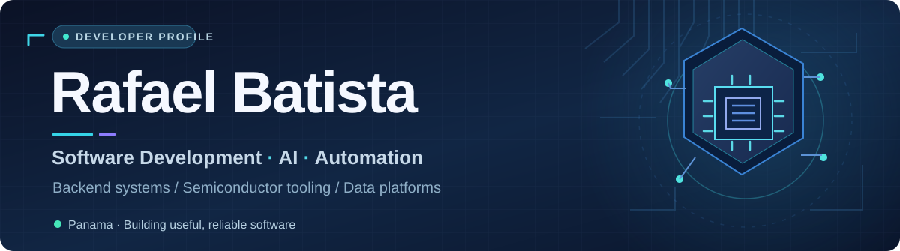
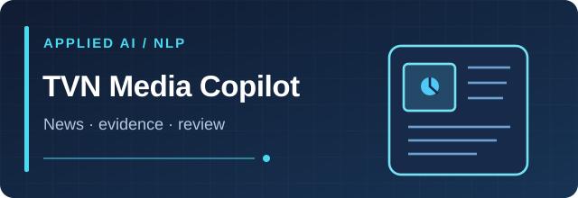
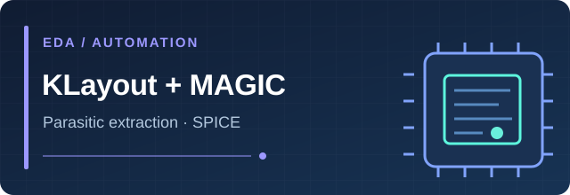
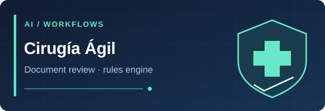
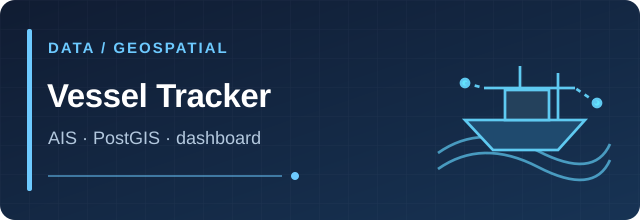
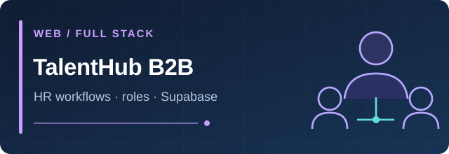

  

  

    
    
    
  

  **Software Developer · AI & Automation · Backend Engineering**

  Based in Panama 🇵🇦 · Interested in remote, part-time and project-based opportunities

---

### 👋 About me

I'm **Rafael Batista**, a Computer Systems Engineering student at the **Technological University of Panama (UTP)**. I enjoy building practical software solutions that bring together **automation, intelligent systems, APIs and data**.

My projects span **AI-assisted workflows**, **semiconductor design-tool automation**, **geospatial data pipelines** and **web applications**. I focus on understandable architectures, useful interfaces and systems that can be tested and improved.

- 🎓 **Education:** Computer Systems Engineering · Universidad Tecnológica de Panamá.
- 🔬 **Semiconductor research:** SENACYT scholarship program; research experience at **CIDESI, Querétaro (2026)**.
- 🤝 **Community:** Secretary, **IEEE Computer Society — UTP Student Branch Chapter**.
- 🌱 **Interests:** backend engineering, applied AI, intelligent automation and developer tooling.

### 🚀 Featured projects

<table>
<tr>
<td width="50%" valign="top">
  
  
<strong><a href="https://github.com/90oso/tvn-media-copilot">TVN Media Copilot</a></strong>

  
Editorial challenge prototype: ingests public news, ranks stories with explainable criteria, organizes evidence and assists drafting with <strong>human review</strong>.

  
<code>Python</code> <code>FastAPI</code> <code>Next.js</code> <code>NLP</code> <code>Gemini</code>

  <a href="https://tvn-media-copilot.vercel.app/">↗ Project demo</a>
</td>
<td width="50%" valign="top">
  
  
<strong><a href="https://github.com/90oso/klayout-magic-pex">KLayout + MAGIC PEX</a></strong>

  
Python macro integrating <strong>KLayout and MAGIC VLSI</strong> through WSL to automate SPICE netlist generation and full-RC parasitic extraction workflows.

  
<code>Python</code> <code>KLayout</code> <code>MAGIC VLSI</code> <code>WSL</code>

  <a href="https://github.com/90oso/klayout-magic-pex">↗ Source &amp; technical details</a>
</td>
</tr>
<tr>
<td width="50%" valign="top">
  
  
<strong><a href="https://github.com/90oso/cirugia-agil">Cirugía Ágil</a></strong>

  
Academic surgical preauthorization <strong>decision-support prototype</strong>: AI document interpretation, deterministic policy checks and Notion-based records. Not a clinical approval system.

  
<code>Python</code> <code>FastAPI</code> <code>Gemini</code> <code>Notion API</code>

  <a href="https://github.com/90oso/cirugia-agil">↗ Architecture &amp; prototype</a>
</td>
<td width="50%" valign="top">
  
  
<strong><a href="https://github.com/90oso/panama-canal-vessel-tracker">Panama Canal Vessel Tracker</a></strong>

  
Academic team project for AIS data ingestion, geospatial queries and vessel visualization in an interactive dashboard. Co-developed with <strong>Daniel Salinas</strong>.

  
<code>PostGIS</code> <code>FastAPI</code> <code>Mage AI</code> <code>Streamlit</code>

  <a href="https://github.com/90oso/panama-canal-vessel-tracker">↗ Data pipeline &amp; dashboard</a>
</td>
</tr>
</table>

  

<strong><a href="https://github.com/90oso/rrhh-sistema">TalentHub B2B</a></strong> — Web-based HR workflow prototype with role-specific modules, Supabase and PostgreSQL.

### 🧰 Tools & technologies

| Focus | Technologies |
|:--|:--|
| **Languages & backend** | `Python` · `JavaScript` · `FastAPI` · `REST APIs` |
| **AI & data** | `scikit-learn` · `NLP` · `Gemini API` · `pandas` |
| **Databases & integration** | `PostgreSQL` · `PostGIS` · `Supabase` · `Notion API` · `DuckDB` |
| **Web & infrastructure** | `React / Next.js` · `HTML / CSS` · `Docker` · `Git / GitHub` |
| **Semiconductor tooling** | `KLayout` · `MAGIC VLSI` · `SPICE` · `WSL` |

### 🎯 What I'm working toward

I'm particularly interested in combining **software engineering, applied AI and automation** to make complex processes easier to use, understand and maintain. I enjoy projects where an idea becomes a working tool and technical decisions are clearly documented.

### 🌎 En español

  
Ver presentación en español

   
  Soy <strong>Rafael Batista</strong>, estudiante de Ingeniería en Sistemas Computacionales en la Universidad Tecnológica de Panamá. Me enfoco en desarrollo de software, backend, inteligencia artificial y automatización. He trabajado en prototipos de agentes inteligentes, herramientas de extracción de parásitos para semiconductores, sistemas web y análisis de datos geoespaciales.
    
  Participo en el programa de semiconductores de SENACYT, realicé una estancia en CIDESI (Querétaro) y soy secretario del capítulo estudiantil IEEE Computer Society de la UTP. Me interesan las oportunidades remotas de medio tiempo y las colaboraciones por proyecto.

---

  <strong>Let's build something useful.</strong>

  
<a href="mailto:rafaelbatistagl@gmail.com">Email</a> · <a href="https://www.linkedin.com/in/rb2003/">LinkedIn</a> · <a href="https://github.com/90oso?tab=repositories">All repositories</a>

  Made with curiosity, documentation and a lot of debugging.

